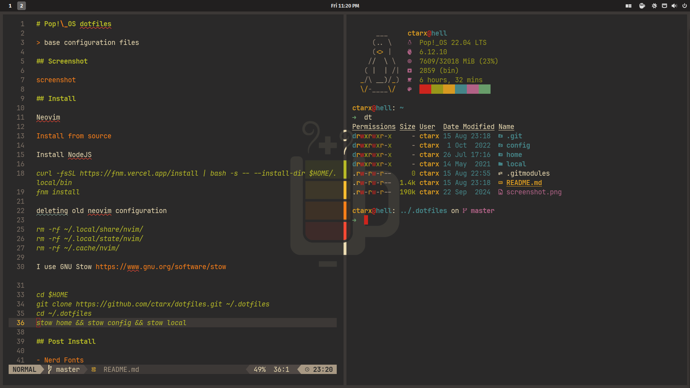

# Pop!\_OS dotfiles

> base configuration files

## Screenshot



## Install

Neovim

```shell
sudo add-apt-repository ppa:neovim-ppa/unstable -y
sudo apt update
sudo apt install make gcc ripgrep unzip git xclip neovim
```

Install NodeJS

```shell
curl -fsSL https://fnm.vercel.app/install | bash -s -- --install-dir $HOME/.local/bin
fnm install
```

deleting old neovim configuration

```shell
rm -rf ~/.local/share/nvim/
rm -rf ~/.local/state/nvim/
rm -rf ~/.cache/nvim/
```

I use GNU Stow [https://www.gnu.org/software/stow](https://www.gnu.org/software/stow)

```shell
cd $HOME
git clone --recurse-submodules https://github.com/ctarx/dotfiles.git ~/.dotfiles
git submodule update --init --recursive
cd ~/.dotfiles
stow home && stow config && stow local
```

## Post Install

- [Nerd Fonts](https://www.nerdfonts.com/font-downloads)

```shell
~/.local/share/fonts
fc-cache -f -v
```

- [Starship prompt](https://starship.rs/)
- [kickstart-modular.nvim](https://github.com/dam9000/kickstart-modular.nvim)

## Nerdfetch

```shell
sudo curl -fsSL https://raw.githubusercontent.com/ThatOneCalculator/NerdFetch/main/nerdfetch -o /usr/bin/nerdfetch
sudo chmod +x /usr/bin/nerdfetch
nerdfetch
```

## Gruvbox colors in gnome-terminal

I use [Gogh](https://github.com/Mayccoll/Gogh)
brilliant project with many themes including gruvbox

## Tmux Plugin Manager

Install [tpm](https://github.com/tmux-plugins/tpm) plugin manager.

```shell
git clone https://github.com/tmux-plugins/tpm ~/.config/tmux/plugins/tpm
```

### Contact

Created by [@ctarx](https://linuxrocks.online/@ctarx) - feel free to contact me!
